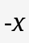
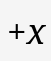
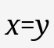
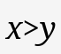
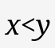
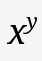
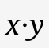

# MILE
Editor for the Math Indicative Language (MIL)

Try it out [here](https://htmlpreview.github.io/?https://raw.githubusercontent.com/Jah-On/MILE/main/index.html)!

# Examples

# Documentation

Invisible groupings are done with semicolons (;) and two semicolons **with no spaces** (;;) ends the group.

| Key word or symbol | Output |
| :----------------: | :----: |
| ens |  |
| infinity |  |
| ins |  |
| nns |  |
| ' |  |
| prime |  |
| rans |  |
| rens |  |
| abs |  |
| coprod |  |
| int |  |
| iint |  |
| iiint |  |
| lim |  |
| liminf |  |
| limsup |  |
| lint |  |
| llint |  |
| lllint |  |
| - |  |
| minus |  |
| neg |  |
| + |  |
| plus |  |
| prod |  |
| sum |  |
| sqrt |  |
| coprodo |  |
| coprodu |  |
| frac |  |
| into |  |
| intu |  |
| iinto |  |
| iintu |  |
| iiinto |  |
| iiintu |  |
| limo |  |
| limu |  |
| liminfo |  |
| liminfu |  |
| limsupo |  |
| limsupu |  |
| linto |  |
| lintu |  |
| llinto |  |
| llintu |  |
| lllinto |  |
| lllintu |  |
| logbase |  |
| sumo |  |
| sumu |  |
| prodo |  |
| produ |  |
| coprodb |  |
| intb |  |
| iintb |  |
| iiintb |  |
| limb |  |
| liminfb |  |
| limsupb |  |
| lintb |  |
| llintb |  |
| lllintb |  |
| prodb |  |
| sumb |  |
| and |  |
| approx |  |
| cdot |  |
| cminus |  |
| cns |  |
| copen |  |
| cplus |  |
| cslash |  |
| ctimes |  |
| def |  |
| div |  |
| \| |  |
| divides |  |
| dlarrow |  |
| dlrarrow |  |
| drarrow |  |
| = |  |
| equals |  |
| equiv |  |
| > |  |
| gthan |  |
| gethan |  |
| geslant |  |
| / |  |
| imgof |  |
| in |  |
| intersect |  |
| < |  |
| lthan |  |
| lethan |  |
| leslant |  |
| >> |  |
| mgthan |  |
| << |  |
| mlthan |  |
| ndivides |  |
| notin |  |
| noteq |  |
| nprec |  |
| nsubset |  |
| nsubsete |  |
| nsucc |  |
| nsupset |  |
| nsupsete |  |
| owns |  |
| or |  |
| origof |  |
| ortho |  |
| parallel |  |
| ^ |  |
| pow |  |
| prec |  |
| preceq |  |
| precsim |  |
| prop |  |
| setm |  |
| setq |  |
| sim |  |
| simeq |  |
| stimes |  |
| subset |  |
| subsete |  |
| succ |  |
| succeq |  |
| succsim |  |
| supset |  |
| supsete |  |
| * |  |
| times |  |
| toward |  |
| union |  |
| xtimes |  |
