# MILE

Editor for the Math Indicative Language (MIL)

(Temporarily Not Working)
Try it out [here](https://htmlpreview.github.io/?https://raw.githubusercontent.com/Jah-On/MILE/main/MILE.html)!

Currently, the only out of the box way to use this program is through the above link. I plan on making a single HTML file that can be download and run in the browser of your preference. I am waiting for feedback first before creating that file.

# How do I save my work?

Hit CTRL + S and name the HTML/ZIP file appropriately. If you use the link above, it will likely download a zip file or bundled HTML file. Extract if neeeded and open the HTML file in the browser. I cannot guarantee this way will work. I advise waiting for the AIO version if you need to save the MIL code.

# What is MIL?

MIL stands for Math Indicative Language and allows for more efficient math display typing compared to LaTeX or LibreOffice's Formula Object language. MIL is also more freely typed.

The two main ways that MIL is more efficient is firstly by using semicolons as invisible groupings compared to curly brackets in LibreOffice's FOL. Semicolons are more centrally located and do not require modifier keys. Secondly, all character math operations (i.e. + - \*) have shortened word equivalents. This means that no modifier key needs to be pressed besides for visible grouping to achieve the same output.

# Why did I make this?

I have Cerebral Palsy which makes writing math, especially for prolonged periods of time, challenging. I wanted a tool that allows for faster typing to compensate for my slower typing, easier to memorize, allows for editing multiple problems within one app/windows, formats the problems neatly, exports easily to PDF (via the print subsystem) or prints directly, and is universally accessable across devices/operating systems.

# Examples

# Documentation

Invisible groupings are done with semicolons (;) and two semicolons **with no spaces** (;;) ends the group.

| Key word or symbol |               Output               |
| :----------------: | :--------------------------------: |
|        ens         |       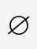       |
|      infinity      |  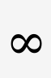  |
|        ins         |       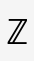       |
|        nns         |       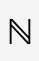       |
|         '          |              |
|       prime        |          |
|        rans        |      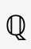      |
|        rens        |      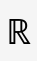      |
|        abs         |       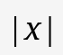       |
|       coprod       |    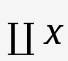    |
|        int         |       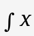       |
|        iint        |      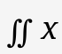      |
|       iiint        |     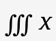     |
|        lim         |       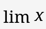       |
|       liminf       |    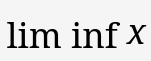    |
|       limsup       |    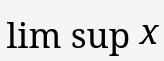    |
|        lint        |      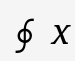      |
|       llint        |     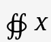     |
|       lllint       |    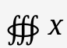    |
|         -          |       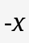       |
|       minus        |          |
|        neg         |       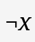       |
|         +          |       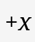        |
|        plus        |            |
|        prod        |      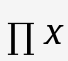      |
|        sum         |       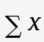       |
|        sqrt        |      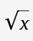      |
|      coprodo       |   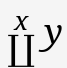   |
|      coprodu       |   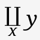   |
|        frac        |      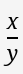      |
|        into        |      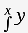      |
|        intu        |      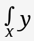      |
|       iinto        |     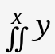     |
|       iintu        |     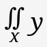     |
|       iiinto       |    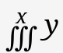    |
|       iiintu       |        |
|        limo        |      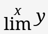      |
|        limu        |      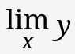      |
|      liminfo       |   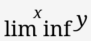   |
|      liminfu       |   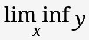   |
|      limsupo       |   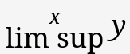   |
|      limsupu       |   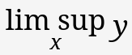   |
|       linto        |     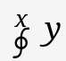     |
|       lintu        |     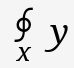     |
|       llinto       |    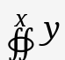    |
|       llintu       |    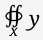    |
|      lllinto       |   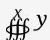   |
|      lllintu       |   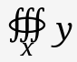   |
|      logbase       |   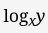   |
|        sumo        |      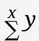      |
|        sumu        |      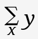      |
|       prodo        |     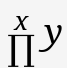     |
|       produ        |     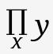     |
|      coprodb       |   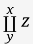   |
|        intb        |      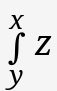      |
|       iintb        |          |
|       iiintb       |        |
|        limb        |            |
|      liminfb       |      |
|      limsupb       |      |
|       lintb        |          |
|       llintb       |        |
|      lllintb       |      |
|       prodb        |          |
|        sumb        |            |
|        and         |              |
|       approx       |        |
|        cdot        |            |
|       cminus       |        |
|        cns         |              |
|       copen        |          |
|       cplus        |          |
|       cslash       |        |
|       ctimes       |        |
|        def         |              |
|        div         |              |
|         \|         |      |
|      divides       |      |
|      dlarrow       |      |
|      dlrarrow      |    |
|      drarrow       |      |
|         =          |             |
|       equals       |        |
|       equiv        |          |
|         >          |              |
|       gthan        |          |
|       gethan       |        |
|      geslant       |      |
|         /          |              |
|       imgof        |          |
|         in         |                |
|     intersect      |  |
|         <          |              |
|       lthan        |          |
|       lethan       |        |
|      leslant       |      |
|       mgthan       |        |
|       mlthan       |        |
|      ndivides      |    |
|       notin        |          |
|       noteq        |          |
|       nprec        |          |
|      nsubset       |      |
|      nsubsete      |    |
|       nsucc        |          |
|      nsupset       |      |
|      nsupsete      |    |
|        owns        |            |
|         or         |                |
|       origof       |        |
|       ortho        |          |
|      parallel      |    |
|         ^          |                |
|        pow         |              |
|        prec        |            |
|       preceq       |        |
|      precsim       |      |
|        prop        |            |
|        setm        |            |
|        setq        |            |
|        sim         |              |
|       simeq        |          |
|       stimes       |        |
|       subset       |        |
|      subsete       |      |
|        succ        |            |
|       succeq       |        |
|      succsim       |      |
|       supset       |        |
|      supsete       |      |
|         \*         |              |
|       times        |          |
|       toward       |        |
|       union        |          |
|       xtimes       |        |

# How can you help?

Please **kindly** report any bugs or provide format/operation/function suggestions! I am eager to hear form those with more advanced knowledge in math!

# Developer info

1. Make sure that Node.js and a package manager such as `npm` is installed
2. `npm install` to install the packages once
3. `npm run dev` to run it in development mode
4. `npm run build` to get a all-in-one, portable HTML file
